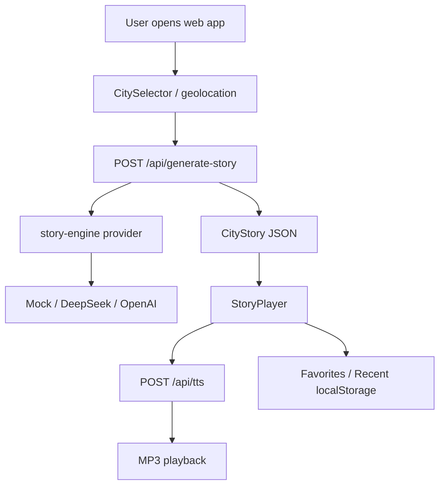

# Architecture

## Stack

- Next.js App Router
- React client components for the main experience
- TypeScript
- Tailwind CSS
- Server routes for story generation, TTS, and reverse geocoding

## Main Flow

## API Routes

### `POST /api/generate-story`

Inputs:

- `city`
- `style`
- optional `format: "standard" | "ar"`

Outputs:

- `story`
- optional `anchors`

The AR anchor response is only a placeholder in V1. It should not be treated as production spatial data until backed by real POI coordinates.

### `POST /api/tts`

Inputs:

- `text`

Outputs:

- `audio/mpeg`

Uses `msedge-tts` on the server. The client falls back to browser speech synthesis if Edge TTS fails.

### `GET /api/reverse-geocode`

Inputs:

- `lat`
- `lng`

Outputs:

- `city`
- `cached`

This route proxies Nominatim from the server and caches approximate coordinates for one hour.

## Data Boundaries

- Recent stories and favorites are local-only in V1.
- API keys stay server-side in `.env.local`.
- Location is used only to resolve a city name. V1 does not persist raw coordinates.

## Known Technical Debt

- Rate limiting is in-memory and resets across deployments.
- Favorites do not sync across devices.
- Real POI anchors are not implemented.
- The story JSON parser assumes valid provider output and should be hardened with schema validation before public launch.
